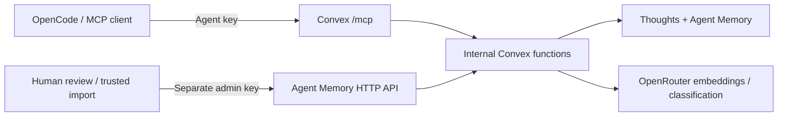

# MCP Development Deployment — 2026-09-17



## Result

Development MCP is deployed and verified at:

```text
https://grandiose-deer-590.convex.site/mcp
```

Use Streamable HTTP with `Authorization: Bearer <MCP_ACCESS_KEY>` or `x-brain-key`. Credentials remain in the ignored integration `.env.local` and the development deployment environment; no secrets are recorded here. Existing OpenCode configuration was not changed.

Production was explicitly deferred. No repository push or public release was performed.

## Changes

- Made every brain and Agent Memory database function internal. Direct unauthenticated Convex calls can no longer bypass HTTP authentication.
- Added a distinct admin credential for human review and trusted imports. Agent write-back cannot self-promote provenance to instruction-grade memory, including by supplying a forged `trusted_writeback` field.
- Implemented MCP initialization, notifications, ping, protocol checks, origin checks, JSON-RPC errors, legacy batching, and validated tool arguments. GET returns `405` because this stateless endpoint does not offer SSE.
- Kept all six thought tools. Capture returns a thought ID for subsequent retrieval and cleanup.
- Added deterministic Convex integration tests and a dedicated CI workflow. Upgraded Convex SDK from 1.38.0 to 1.45.0 to satisfy the current test library's peer requirement.
- Replaced the shallow smoke check with an official MCP SDK client exercising all six tools and real embedding-backed capture/search/fetch.
- Installed required development secrets and replaced the placeholder citation root with the protected REST thought endpoint. Citation URLs require authentication; a dashboard remains optional.

## Verification

| Check | Result |
| --- | --- |
| `pnpm install --frozen-lockfile` | Passed in the integration directory |
| `pnpm peers check` | No peer dependency issues |
| `pnpm typecheck` | Passed |
| `pnpm test` | 20 tests passed across two files |
| `node --check smoke/live-smoke.mjs` | Passed |
| `pnpm convex dev --once --typecheck enable --tail-logs disable` | Deployed successfully; command exited |
| `node --env-file=.env.local smoke/live-smoke.mjs` | Passed: auth/origin rejection, blocked direct Convex query, SDK handshake, all six tools, real embedding retrieval |
| Smoke cleanup | One temporary thought deleted |
| `opencode mcp list --pure` with isolated, temporary config | `ob1-development` connected |
| Independent Luna review | No remaining blocker for this private development deployment |

Regression tests cover missing/bad credentials, bearer/header/query authentication, restricted thoughts, provider errors, initialization and notification handling, protocol/origin rejection, agent/admin separation, untrusted provenance, human confirmation, and unsafe write-back rejection. Parent review strengthened the review test to assert a real pending-to-confirmed transition.

The first integration test run failed while the HTTP agent was still replacing the public API references and protocol implementation. Those failures are resolved. Dependency setup initially found a Convex peer mismatch and a broken Vite peer link; the SDK upgrade and `pnpm install --fix-lockfile` resolved both. A frozen-install command initially ran from the repository root, which has no package manifest; rerunning in the integration directory passed.

Non-fatal CLI notices: Node emitted an experimental localStorage warning; Convex reported it could not auto-update `VITE_CONVEX_URL` and suggested refreshing generated AI guidance. No duplicate local environment names were found, and neither notice prevented deployment or the live checks.

## Boundaries and Next Release

- This is a private brain with shared agent/admin credentials, not a multi-tenant identity or OAuth service.
- MCP exposes captured thoughts; Agent Memory recall/write-back/review remains a separate REST API.
- Production still needs an explicit target, its own credentials, deployment, and the same live checks. Configure secrets with `--prod` before a production release; bare `convex deploy` normally targets production.
- Rotate either key by updating the deployed secret and its clients. Keep the admin key out of agent runtimes.
- The current Linear account could not retrieve `NAT-833` (`Entity not found`). This document records the implementation and verification checkpoint in its place; no Linear update was claimed.

See the [deployment and connection guide](../integrations/convex-open-brain/README.md). Open Brain is a practical system from Nate B. Jones / OB1: [Nate's Substack](https://substack.com/@natesnewsletter), [natebjones.com](https://natebjones.com).
