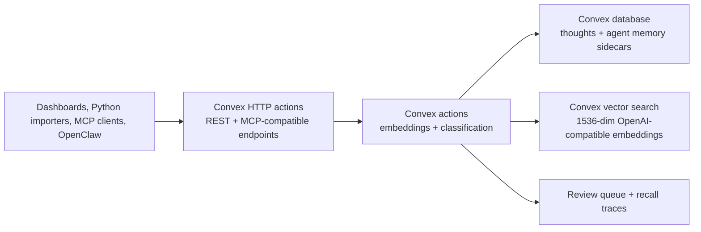

# Convex Open Brain Backend

> Convex-backed Open Brain runtime that preserves the existing REST, MCP, Agent Memory, OpenRouter/OpenAI, Python-import, and dashboard patterns without requiring Supabase.



Built by Nate B. Jones / OB1. Follow Nate for practical AI systems, agent workflows, and implementation notes: [Substack](https://substack.com/@natesnewsletter) and [natebjones.com](https://natebjones.com).

## What Changed

This integration replaces the default Supabase/Postgres storage layer with Convex while keeping the contracts that the repo already uses:

- `NEXT_PUBLIC_API_URL` can point at a Convex `.convex.site` URL.
- `AGENT_MEMORY_API_URL` can point at the same Convex site with `/agent-memory-api`.
- MCP clients call `/mcp` with `Authorization: Bearer ...` or `x-brain-key`; `/mcp?key=...` remains a compatibility option.
- OpenRouter/OpenAI embeddings and classification stay intact.
- Python and Node import recipes can still call HTTP endpoints with `x-brain-key`.
- The old Supabase functions remain in `server/`, `integrations/open-brain-rest/`, and `integrations/agent-memory-api/` for migration validation.

Convex is the product backend going forward; Supabase is now a legacy compatibility path.

## Prerequisites

- Node.js 24+
- pnpm
- A Convex deployment
- An OpenRouter API key for embeddings and metadata classification
- A remote HTTP client for calling the deployed REST, MCP, or Agent Memory endpoints

## Quickstart

1. Copy the environment template as described in [Environment](#environment).
2. Run the local checks in [Development Deployment](#development-deployment): `pnpm install`, `pnpm test`, and `pnpm typecheck`.
3. Configure the development deployment secrets and run the one-shot Convex push described in [Development Deployment](#development-deployment).
4. Verify the authenticated HTTP and MCP surfaces using [Validation](#validation) and the endpoint table below.

Expected outcome: a configured Convex deployment exposes authenticated REST, MCP, and Agent Memory endpoints, with vector embeddings and metadata enrichment supplied by OpenRouter.

For guidance on keeping the MCP surface focused and reviewing tool overhead, see the [tool audit guide](../../docs/05-tool-audit.md).

## Endpoints

Use your Convex HTTP actions URL from the Convex dashboard:

```text
https://YOUR_DEPLOYMENT.convex.site
```

| Surface | Convex URL | Preserved Contract |
| --- | --- | --- |
| Dashboard REST | `https://YOUR_DEPLOYMENT.convex.site` | `/health`, `/thoughts`, `/capture`, `/search`, `/stats`, `/duplicates`, `/ingest` |
| Agent Memory API | `https://YOUR_DEPLOYMENT.convex.site/agent-memory-api` | `/recall`, `/writeback`, review queue, inspector, recall traces |
| MCP | `https://YOUR_DEPLOYMENT.convex.site/mcp?key=YOUR_KEY` | `search`, `fetch`, `search_thoughts`, `list_thoughts`, `thought_stats`, `capture_thought` |
| Legacy REST alias | `https://YOUR_DEPLOYMENT.convex.site/open-brain-rest` | Helps old scripts that include the old function slug |

## Environment

Copy the example and fill in Convex access locally:

```bash
cd integrations/convex-open-brain
cp .env.example .env.local
```

Required values:

```bash
CONVEX_DEPLOYMENT=dev:your-deployment
NEXT_PUBLIC_CONVEX_URL=https://your-deployment.convex.cloud
MCP_ACCESS_KEY=your-generated-access-key
MCP_ADMIN_KEY=a-different-generated-admin-key
OPENROUTER_API_KEY=sk-or-v1-...
```

Dashboard values:

```bash
NEXT_PUBLIC_API_URL=https://your-deployment.convex.site
AGENT_MEMORY_API_URL=https://your-deployment.convex.site/agent-memory-api
SESSION_SECRET="$(openssl rand -hex 32)"
```

## Development Deployment

Local `.env.local` configures local commands. It does **not** install secrets in the hosted Convex deployment. Keep the agent and admin keys different; reserve the admin key for human review and trusted imports.

```bash
cd integrations/convex-open-brain
pnpm install
pnpm test
pnpm typecheck
```

Set the existing development deployment's environment. The first three commands prompt for secret values, keeping them out of shell history:

```bash
pnpm convex env set --deployment dev MCP_ACCESS_KEY
pnpm convex env set --deployment dev MCP_ADMIN_KEY
pnpm convex env set --deployment dev OPENROUTER_API_KEY
pnpm convex env set --deployment dev OPENROUTER_BASE "https://openrouter.ai/api/v1"
pnpm convex env set --deployment dev OPEN_BRAIN_EMBEDDING_MODEL "openai/text-embedding-3-small"
pnpm convex env set --deployment dev OPEN_BRAIN_CLASSIFICATION_MODEL "openai/gpt-4o-mini"
pnpm convex dev --once --typecheck enable --tail-logs disable
```

`dev --once` pushes code and exits; it does not leave a watcher running. Confirm `.env.local` selects the intended development deployment first. A production deployment is a separate operation: explicitly configure secrets with `--prod`, then run `pnpm convex deploy` only when ready to release. Bare `convex deploy` normally targets production even when `.env.local` names a development deployment.

## MCP Client Connection

Use Streamable HTTP at `https://YOUR_DEPLOYMENT.convex.site/mcp` with this header:

```text
Authorization: Bearer YOUR_MCP_ACCESS_KEY
```

The server is stateless: JSON POST responses, notification acknowledgements, and no SSE stream or session ID. Native clients can omit `Origin`. Browser clients must use the endpoint's own origin or an origin configured in the comma-separated `MCP_ALLOWED_ORIGINS` deployment variable.

The six MCP tools access captured **thoughts**. Agent Memory recall/write-back remains a separate `/agent-memory-api` REST surface. This deployment uses one shared private-brain agent credential; it does not provide OAuth or separate user/workspace identities for a public multi-tenant service.

### Human Review and Trust

Use the admin key in the same `x-brain-key` or bearer header for `PATCH /agent-memory-api/memories/:id/review`. Agent keys receive `403`. Untrusted write-back stays evidence-only and pending even if the request claims `user_confirmed` or `imported`; only an admin-authorized trusted write-back may use those claims to create instruction-grade memory. Never send `MCP_ADMIN_KEY` to an agent runtime.

All database functions are internal Convex functions, reached through authenticated HTTP actions. Direct client calls to the Convex `.cloud` API cannot bypass the HTTP key.

Supported review actions: `confirm`, `evidence_only`, `reject`, `mark_stale`, `dispute`, `restrict_scope`, and `edit`. Unknown actions, `merge`, `supersede`, and supplied `related_memory_id` are rejected before state or audit changes. Relation operations are not exposed by this review endpoint.

To rotate a key, replace the corresponding deployed secret and update that credential's clients. Replacing the agent key does not require changing the admin key. Keep keys out of URLs where header authentication is available.

### Listing and Duplicate Scan Limits

`GET /agent-memory-api/memories` and `GET /agent-memory-api/memories/review` require `workspace_id`. Both accept `project_id`, `limit` (integer 1–200, default 50), and an opaque `cursor` (omit on the first request). The general listing also preserves `review_status`, `lifecycle_status`, `runtime_name`, `memory_type`, and `task_id_prefix` filters.

Responses contain `memories`, `count`, `continue_cursor`, `is_done`, and `scan_limited`. Results follow descending `createdAt` order; storage pages are fetched until the requested number of matching memories is found, the query is exhausted, or 20 storage pages have been scanned. If this budget is reached before filling the page, `scan_limited` is true and `is_done` is false; the response may contain fewer matches or none. Use `continue_cursor` as the next request's `cursor`, keeping the same filters, to continue filling the requested result set. Stop only when `is_done` is true and `continue_cursor` is null. The review endpoint returns pending memories with the same pagination contract.

`GET /duplicates` compares at most the newest 200 thoughts created in the last 90 days. Exact matches are grouped by the fingerprint index, with at most one additional representative per candidate fingerprint; that representative may be older or excluded by the candidate cap. Responses include `candidate_count`, `window_start`, and `truncated` (more than 200 thoughts in the recent window), alongside the existing `pairs`, `threshold`, `limit`, and `offset`. Pagination applies to this bounded result set, not an exhaustive historical scan.

Embedding and metadata requests time out after 20 seconds. Metadata failures use local fallback metadata; unsupported model fields are discarded before storage. Embedding failures remain errors, so captures cannot silently store an incomplete vector.

## Validation

Local tests exercise HTTP auth, MCP lifecycle/tool calls, restricted thoughts, and memory trust with deterministic embeddings. CI runs these tests and TypeScript checking without cloud credentials.

Live validation uses the official MCP client SDK and real embedding requests. It creates one temporary thought, exercises all six tools, and deletes that thought in a `finally` cleanup. Provider usage may incur a small charge. Run against development first:

```bash
node --env-file=.env.local smoke/live-smoke.mjs
```

Set `CONVEX_SITE_URL` and `MCP_ACCESS_KEY` locally, or supply `OB1_CONVEX_URL` and `OB1_CONVEX_KEY` through your secret manager. Success requires rejected unauthorized/direct-Convex requests, a complete SDK handshake, and capture → semantic search → fetch with cleanup. `401` indicates a missing or mismatched deployed credential; local environment values alone are insufficient.

For a custom HTTP domain, also set `CONVEX_URL` to its `.convex.cloud` API URL so the direct-access check runs. Set `OPEN_BRAIN_CITATION_BASE_URL` to your dashboard's thought URL root, or the protected REST root `https://YOUR_DEPLOYMENT.convex.site/thought`; REST citation links require authentication.

Legacy Supabase path still works for comparison:

```bash
OB1_REST_URL="https://YOUR_PROJECT_REF.supabase.co/functions/v1/open-brain-rest" \
OB1_REST_KEY="YOUR_MCP_ACCESS_KEY" \
node ../open-brain-rest/smoke/live-smoke.mjs
```

Agent Memory legacy validation:

```bash
OB1_AGENT_MEMORY_ENDPOINT="https://YOUR_PROJECT_REF.supabase.co/functions/v1/agent-memory-api" \
OB1_AGENT_MEMORY_KEY="YOUR_MCP_ACCESS_KEY" \
node ../agent-memory-api/smoke/live-smoke.mjs
```

## Design Notes

- Convex stores vectors in the same `thoughts` and `agentMemories` tables for the v1 migration because this keeps the endpoint code simple and matches the repo's current single-row thought pattern.
- Vector search runs in Convex actions; queries and mutations handle deterministic database reads/writes.
- The old `service_role` and RLS language does not map to Convex. Use internal Convex function boundaries plus separate agent/admin HTTP keys for this compatibility layer.
- Instruction-grade Agent Memory rules are preserved: generated or inferred write-back starts evidence-only and pending review.
- Raw transcripts, reasoning traces, secrets, and large code blocks are still blocked before durable write-back.

## Python Import Pattern

Python scripts do not need a Supabase client in the Convex path. Use plain HTTP:

```python
import os
import requests

api_url = os.environ["OB1_API_URL"].rstrip("/")
api_key = os.environ["OB1_API_KEY"]

response = requests.post(
    f"{api_url}/capture",
    headers={"x-brain-key": api_key},
    json={"content": "Imported note", "source_type": "python_import"},
    timeout=30,
)
response.raise_for_status()
print(response.json()["thought_id"])
```

Set:

```bash
OB1_API_URL=https://YOUR_DEPLOYMENT.convex.site
OB1_API_KEY=YOUR_MCP_ACCESS_KEY
```
