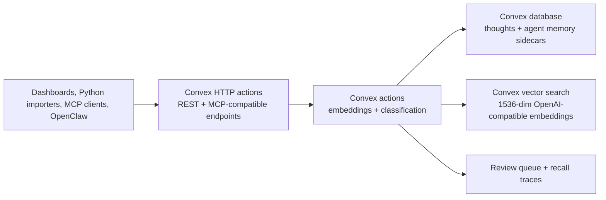

# Convex Open Brain Backend

> Convex-backed Open Brain runtime that preserves the existing REST, MCP, Agent Memory, OpenRouter/OpenAI, Python-import, and dashboard patterns without requiring Supabase.



Built by Nate B. Jones / OB1. Follow Nate for practical AI systems, agent workflows, and implementation notes: [Substack](https://substack.com/@natesnewsletter) and [natebjones.com](https://natebjones.com).

## What Changed

This integration replaces the default Supabase/Postgres storage layer with Convex while keeping the contracts that the repo already uses:

- `NEXT_PUBLIC_API_URL` can point at a Convex `.convex.site` URL.
- `AGENT_MEMORY_API_URL` can point at the same Convex site with `/agent-memory-api`.
- MCP clients can call `/mcp?key=...`.
- OpenRouter/OpenAI embeddings and classification stay intact.
- Python and Node import recipes can still call HTTP endpoints with `x-brain-key`.
- The old Supabase functions remain in `server/`, `integrations/open-brain-rest/`, and `integrations/agent-memory-api/` for migration validation.

Convex is the product backend going forward; Supabase is now a legacy compatibility path.

## Endpoints

Use your Convex HTTP actions URL from the Convex dashboard:

```text
https://YOUR_DEPLOYMENT.convex.site
```

| Surface | Convex URL | Preserved Contract |
| --- | --- | --- |
| Dashboard REST | `https://YOUR_DEPLOYMENT.convex.site` | `/health`, `/thoughts`, `/capture`, `/search`, `/stats`, `/duplicates`, `/ingest` |
| Agent Memory API | `https://YOUR_DEPLOYMENT.convex.site/agent-memory-api` | `/recall`, `/writeback`, review queue, inspector, recall traces |
| MCP | `https://YOUR_DEPLOYMENT.convex.site/mcp?key=YOUR_KEY` | `search`, `fetch`, `search_thoughts`, `list_thoughts`, `thought_stats`, `capture_thought` |
| Legacy REST alias | `https://YOUR_DEPLOYMENT.convex.site/open-brain-rest` | Helps old scripts that include the old function slug |

## Environment

Copy the example and fill in Convex access locally:

```bash
cd integrations/convex-open-brain
cp .env.example .env.local
```

Required values:

```bash
CONVEX_DEPLOYMENT=dev:your-deployment
NEXT_PUBLIC_CONVEX_URL=https://your-deployment.convex.cloud
MCP_ACCESS_KEY=your-generated-access-key
OPENROUTER_API_KEY=sk-or-v1-...
```

Dashboard values:

```bash
NEXT_PUBLIC_API_URL=https://your-deployment.convex.site
AGENT_MEMORY_API_URL=https://your-deployment.convex.site/agent-memory-api
SESSION_SECRET="$(openssl rand -hex 32)"
```

## Setup

```bash
cd integrations/convex-open-brain
pnpm install
pnpm convex dev
```

Set production environment variables in Convex before deploying:

```bash
pnpm convex env set MCP_ACCESS_KEY "your-generated-access-key"
pnpm convex env set OPENROUTER_API_KEY "sk-or-v1-..."
pnpm convex env set OPENROUTER_BASE "https://openrouter.ai/api/v1"
pnpm convex env set OPEN_BRAIN_EMBEDDING_MODEL "openai/text-embedding-3-small"
pnpm convex env set OPEN_BRAIN_CLASSIFICATION_MODEL "openai/gpt-4o-mini"
pnpm convex deploy
```

## Validation

Convex path:

```bash
OB1_CONVEX_URL="https://YOUR_DEPLOYMENT.convex.site" \
OB1_CONVEX_KEY="YOUR_MCP_ACCESS_KEY" \
pnpm smoke
```

Legacy Supabase path still works for comparison:

```bash
OB1_REST_URL="https://YOUR_PROJECT_REF.supabase.co/functions/v1/open-brain-rest" \
OB1_REST_KEY="YOUR_MCP_ACCESS_KEY" \
node ../open-brain-rest/smoke/live-smoke.mjs
```

Agent Memory legacy validation:

```bash
OB1_AGENT_MEMORY_ENDPOINT="https://YOUR_PROJECT_REF.supabase.co/functions/v1/agent-memory-api" \
OB1_AGENT_MEMORY_KEY="YOUR_MCP_ACCESS_KEY" \
node ../agent-memory-api/smoke/live-smoke.mjs
```

## Design Notes

- Convex stores vectors in the same `thoughts` and `agentMemories` tables for the v1 migration because this keeps the endpoint code simple and matches the repo's current single-row thought pattern.
- Vector search runs in Convex actions; queries and mutations handle deterministic database reads/writes.
- The old `service_role` and RLS language does not map to Convex. Use Convex function boundaries plus `MCP_ACCESS_KEY` for this compatibility layer.
- Instruction-grade Agent Memory rules are preserved: generated or inferred write-back starts evidence-only and pending review.
- Raw transcripts, reasoning traces, secrets, and large code blocks are still blocked before durable write-back.

## Python Import Pattern

Python scripts do not need a Supabase client in the Convex path. Use plain HTTP:

```python
import os
import requests

api_url = os.environ["OB1_API_URL"].rstrip("/")
api_key = os.environ["OB1_API_KEY"]

response = requests.post(
    f"{api_url}/capture",
    headers={"x-brain-key": api_key},
    json={"content": "Imported note", "source_type": "python_import"},
    timeout=30,
)
response.raise_for_status()
print(response.json()["thought_id"])
```

Set:

```bash
OB1_API_URL=https://YOUR_DEPLOYMENT.convex.site
OB1_API_KEY=YOUR_MCP_ACCESS_KEY
```
